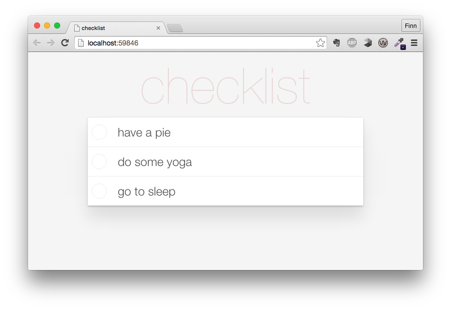

# chec
[](https://nodei.co/npm/chec/)

Pipe newline seperated todos to chech and it will open a browser window and show the todos.

```sh
echo "have a pie\ndo some yoga\ngo to sleep" | chec
```




Example for piping open pullrequests to a todo list:
```sh
open-prs | ndjson-format '<a href="${this.html_url}">${this.title}</a>' | chec
```